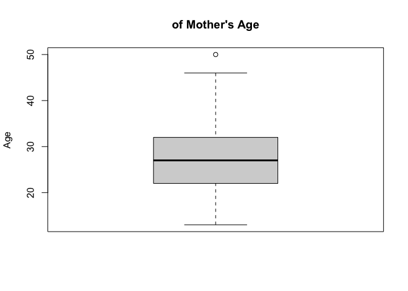
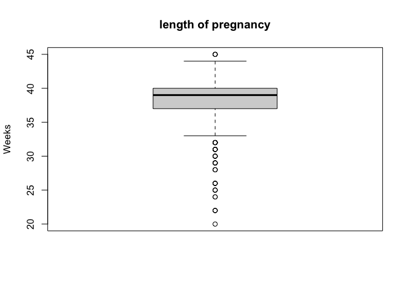
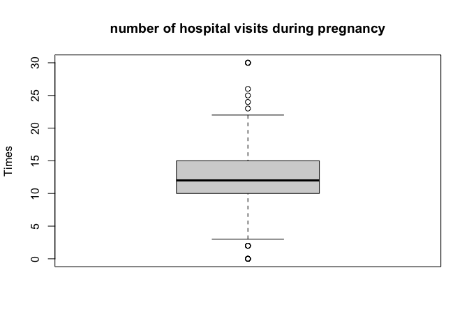
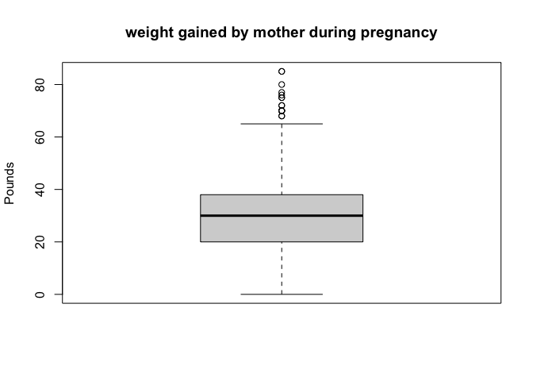
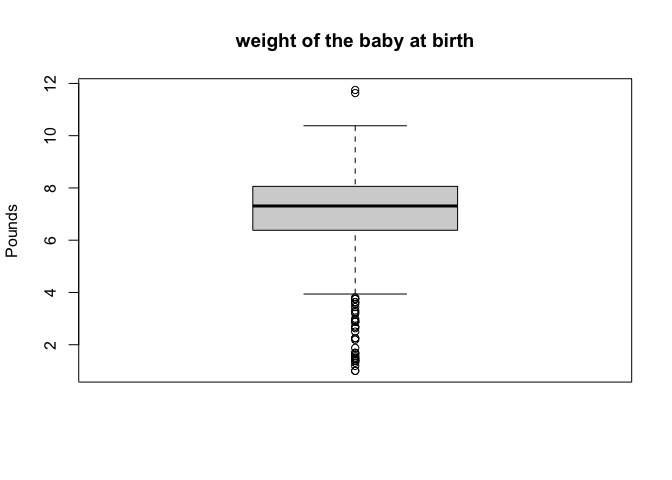
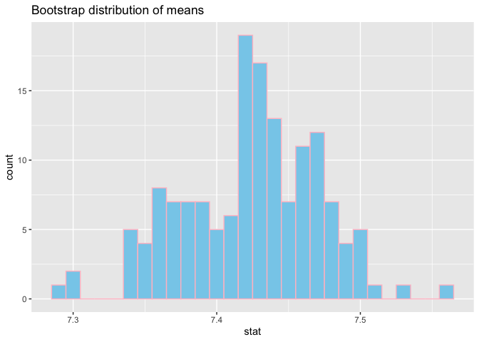

Lab 12 - Smoking during pregnancy
================
Allison Li
20250430

## This lab is mainly for replacing a porfolio piece, so I will be finishing the lab while giving suggestions on how to refine!

### Load packages and data

``` r
##install.packages("openintro")
##install.packages("infer")
library(infer)
library(tidyverse) 
library(tidymodels)
library(openintro)

##set a seed
set.seed(1234)
```

### Exercise 1

``` r
data(ncbirths)

boxplot(ncbirths$mage, main = "of Mother's Age", ylab = "Age")
```

<!-- -->

``` r
boxplot(ncbirths$fage, main = "Father's Age", ylab = "Age")
```

<!-- -->

``` r
boxplot(ncbirths$weeks, main = "length of pregnancy", ylab = "Weeks")
```

<!-- -->

``` r
boxplot(ncbirths$visits, main = "number of hospital visits during pregnancy", ylab = "Times")
```

<!-- -->

``` r
boxplot(ncbirths$gained, main = "weight gained by mother during pregnancy", ylab = "Pounds")
```

<!-- -->

``` r
boxplot(ncbirths$weight, main = "weight of the baby at birth", ylab = "Pounds")
```

<!-- -->

Categorical variables:mature, premie, marital, lowbirthweight, gender,
habit, whitemom Numeric variables:fage, mage, weeks, visits, gained,
weight There is one outlier for mage, two for fage, multiple (11) for
weeks, 7 for visits, multiple for gained, and many outliers for weight.

The cases are the comprehensive birth record for infants in North
Carolina, 2004. Each case in the dataset is the information about their
father and mother during pregancy for each infant. There are 1000 cases
in the sample

### Exercise 2

``` r
ncbirths_white <- ncbirths %>%
  filter(whitemom == "white")

mean(ncbirths_white$weight, na.rm = TRUE)
```

    ## [1] 7.250462

### Exercise 3

I believe the criteria are satisfied. The dataset has relatively large
sample (1000) and the observations are random and independent of each
other.

### Exercise 4

``` r
set.seed(1234)
bootstrap <- ncbirths_white %>%
  specify(response = weight) %>%
  generate(reps = 1500, type = "bootstrap") %>%
  calculate(stat = "mean")
summary(bootstrap)
```

    ##    replicate           stat      
    ##  Min.   :   1.0   Min.   :7.069  
    ##  1st Qu.: 375.8   1st Qu.:7.210  
    ##  Median : 750.5   Median :7.248  
    ##  Mean   : 750.5   Mean   :7.248  
    ##  3rd Qu.:1125.2   3rd Qu.:7.285  
    ##  Max.   :1500.0   Max.   :7.454

``` r
obs_mean <- mean(ncbirths_white$weight)
centered_dist <- bootstrap %>%
  mutate(stat = stat - obs_mean + 7.43)

##I asked gpt bc I do not know how to calculate the p value in this way
p_value <- centered_dist %>%
  summarise(
    p_val = mean(abs(stat - 7.43) >= abs(obs_mean - 7.43))
    ) %>%
  pull(p_val)

bootstrap %>% 
  summarize(lower = quantile(stat, .025),
            uppter = quantile(stat, .975))
```

    ## # A tibble: 1 × 2
    ##   lower uppter
    ##   <dbl>  <dbl>
    ## 1  7.14   7.35

``` r
##Plot
ggplot(data = centered_dist, mapping = aes(x = stat)) +
  geom_histogram(binwidth = .01, fill = "skyblue", color = "pink") +
  geom_vline(xintercept = obs_mean, color = "red", linetype = "dashed", size = 1) +
  labs(title = "Null distribution of means")
```

    ## Warning: Using `size` aesthetic for lines was deprecated in ggplot2 3.4.0.
    ## ℹ Please use `linewidth` instead.
    ## This warning is displayed once every 8 hours.
    ## Call `lifecycle::last_lifecycle_warnings()` to see where this warning was
    ## generated.

<!-- -->

The null hypothesis: H0: u = 7.43; Alternative hypothesis: H1: u ≠ 7.43

According to the table, there is no sample with a mean less than 7.25.
According to the output, the observed mean birth weight of babies born
to White mothers in the sample was 7.25 pounds. To test the hypothesis,
we generated 150 bootstrap samples of the data. The resulting p-value
was .002, which suggests we can reject the null hypothesis and conclude
that the observed value is significantly lower than the historical
weight of 7.43 pounds.

My suggestions for Exercise 4 is to break this into more seperate
sections perhaps? The instructions is clear, but maybe we can do 4.1,
4.2 and 4.3 for the steps, including listing the hypothesis and choose
what test to run, and then the plotting, and then the p value and
report.

### Exercise 5

``` r
ggplot(data = ncbirths, aes(x = habit, y = weight)) +
  geom_boxplot(fill = "pink") +
  labs(title = "Baby Weight by Mother's Smoking Habit",
       x = "Mother's Smoking Habit",
       y = "Baby Weight (lbs)")
```

<!-- -->

Based on the graph, we can assume that mother who smoke tends to have a
lighter baby weight, although we do not know if the difference is
statistically significant (since there are a lot of observed outliers in
the nonsmoker group).

### Exercise 6

``` r
ncbirths_clean <- ncbirths %>%
  filter(!is.na(habit) & !is.na(weight))
```

### Exercise 7

``` r
ncbirths_clean %>%
  group_by(habit) %>%
  summarize(mean_weight = mean(weight))
```

    ## # A tibble: 2 × 2
    ##   habit     mean_weight
    ##   <fct>           <dbl>
    ## 1 nonsmoker        7.14
    ## 2 smoker           6.83

### Exercise 8

H0: the weight of the infant whose mother is smoker = the weight of the
infant whose mother does not smoke (μ1 = μ2)

H1: the weight of the infant whose mother is smoker ≠ the weight of the
infant whose mother does not smoke (μ1 ≠ μ2)

### Exercise 9

``` r
t.test(weight ~ habit, data = ncbirths_clean)
```

    ## 
    ##  Welch Two Sample t-test
    ## 
    ## data:  weight by habit
    ## t = 2.359, df = 171.32, p-value = 0.01945
    ## alternative hypothesis: true difference in means between group nonsmoker and group smoker is not equal to 0
    ## 95 percent confidence interval:
    ##  0.05151165 0.57957328
    ## sample estimates:
    ## mean in group nonsmoker    mean in group smoker 
    ##                7.144273                6.828730

according to the output, p = .02, which is statistically significant at
the .05 significance level. Therefore, it can be conclude that the
average weight of infants whose mother is not smoker is significantly
heavier than the average weight of infants whose mother is smoker.
Additionally, we are 95% confident that the true difference in means
between non-smoker and smoker mother is between about 0.05 and 0.58
pounds.

### Exercise 10

``` r
set.seed(1234)
bootstrap_clean <- ncbirths_clean %>%
  specify(weight ~ habit) %>%
  generate(reps = 1500, type = "bootstrap") %>%
  calculate(stat = "diff in means", order = c("nonsmoker", "smoker"))
bootstrap_clean %>%
  get_confidence_interval(level = 0.95, type = "percentile")
```

    ## # A tibble: 1 × 2
    ##   lower_ci upper_ci
    ##      <dbl>    <dbl>
    ## 1   0.0640    0.575

The bootstrapping showed a slightly different value for CI than the
sample, but it still indicates a statistically significant difference
between the two groups.

This part looks great and I do not have much suggestions! In terms of
Exercise 10, I think it can be more clear on what way you want us to
calculate the CI, since there are functions/ equations that can directly
generate the CI, and there are codes that will calculate step by step (i
guess this depends on your goal).

### Exercise 11

``` r
ncbirths %>%
  summarise(
    min = min(mage, na.rm = TRUE),
    q1 = quantile(mage, 0.25, na.rm = TRUE),
    median = median(mage, na.rm = TRUE),
    mean = mean(mage, na.rm = TRUE),
    q3 = quantile(mage, 0.75, na.rm = TRUE),
    max = max(mage, na.rm = TRUE),
    sd = sd(mage, na.rm = TRUE)
  )
```

    ## # A tibble: 1 × 7
    ##     min    q1 median  mean    q3   max    sd
    ##   <int> <dbl>  <dbl> <dbl> <dbl> <int> <dbl>
    ## 1    13    22     27    27    32    50  6.21

I looked at the max, min, and mean of mother’s age, and decided to set
the cutoff for younger and mature mother at the age of 27, which is the
mean and median (lucky they are the same number).

### Exercise 12

H0: the proportion of low birth weight babies is the same for mature
mothers and younger mother (μ1 = μ2);

H1: the proportion of low birth weight babies is significantly higher
for mature mothers than younger mother (μ1 \> μ2)

``` r
set.seed(1234)
ncbirths_lowbirth <- ncbirths %>%
  mutate(lowbirthweight = if_else(lowbirthweight == "low", 1, 0)) %>%
  mutate(age_group = if_else(mage < 27, "younger", "older"))

## This would tell me the observed difference in low birthweight proportions
obs_diff <- ncbirths_lowbirth %>%
  group_by(age_group) %>%
  summarise(prop_low = mean(lowbirthweight), .groups = "drop") %>%
  pivot_wider(names_from = age_group, values_from = prop_low) %>%
  mutate(diff = older - younger) %>%
  pull(diff)

## The test
ncbirths_lowbirth <- ncbirths_lowbirth %>%
  mutate(lowbirthweight_str = as.character(lowbirthweight))

lowbirthboot <- ncbirths_lowbirth %>%
  specify(lowbirthweight_str ~ age_group, success = "1") %>%
  hypothesize(null = "independence") %>%
  generate(reps = 1500, type = "permute") %>%
  calculate(stat = "diff in props", order = c("younger", "older"))

# One-sided p-value from GPT 
p_value <- lowbirthboot %>%
  get_p_value(obs_stat = obs_diff, direction = "right")

p_value
```

    ## # A tibble: 1 × 1
    ##   p_value
    ##     <dbl>
    ## 1   0.412

Based on the results, a p-value of .41 is found, which is larger than
the significance level of 0.05. Therefore, we failed to reject the null
hypothesis, which indicates that there is no statistically significance
between the proportion of low birth weight babies from older mothers (27
and above) and among younger mothers.

### Exercise 13

``` r
ci <- lowbirthboot %>%
  get_confidence_interval(level = 0.95, type = "percentile")

ci
```

    ## # A tibble: 1 × 2
    ##   lower_ci upper_ci
    ##      <dbl>    <dbl>
    ## 1  -0.0402   0.0398

Based on 1500 bootstrap samples, the 95% CI is (-.04, 0.04).Since the
interval includes 0, we can conclude that there no statistically
significant difference in low birth weight rates between the two age
groups of mothers.

I really enjoyed how this part is constructed! I think it can also be
interesting if you ask one more question about exploring the dataset
with variables students might be interested in? Additionally, for the
whole lab, I think the goal is to get better idea how to do
bootstrapping, so some Exercise can be more specifically targeted at
using bootstrapping? I am not sure if this makes sense, but I really
enjoyed this lab cause I have learned a lot.
